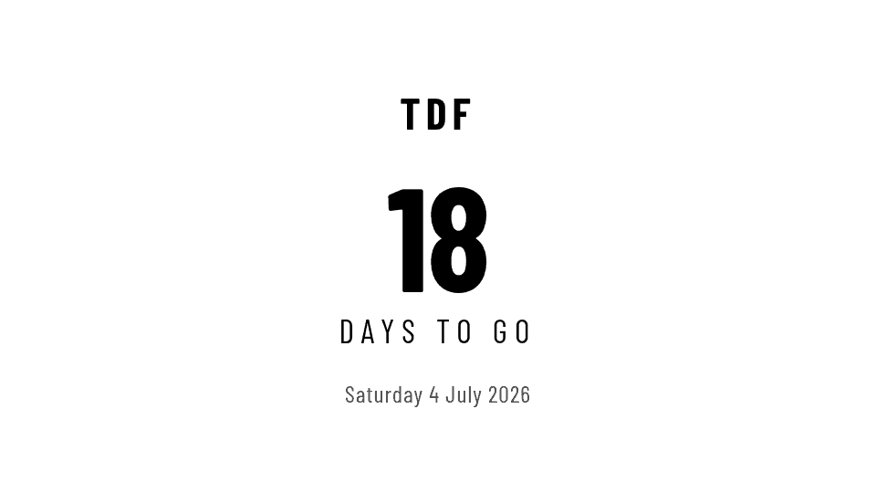
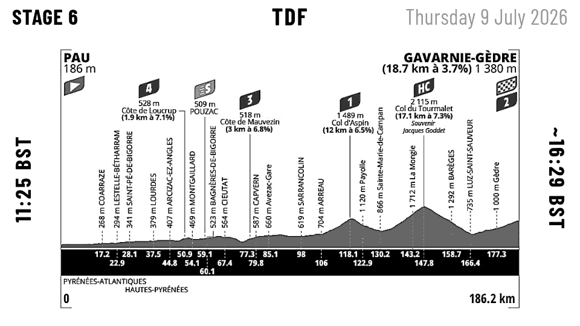
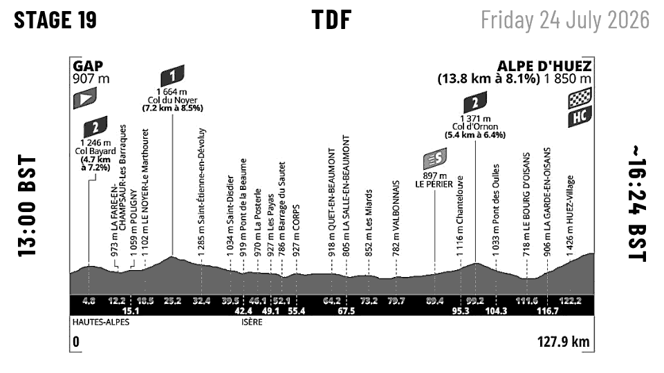
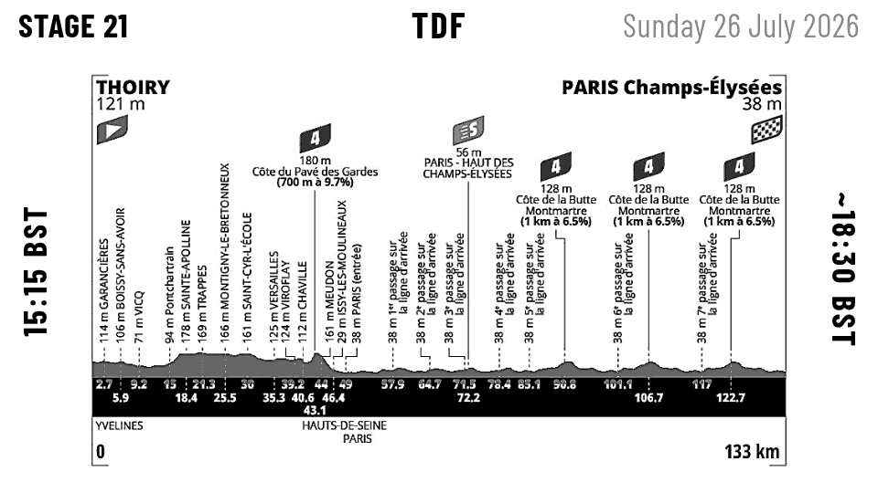

# TRMNL Grand Tour Stage Profile

A [TRMNL](https://usetrmnl.com) BYOS recipe for [LaraPaper](https://github.com/usetrmnl/larapaper) that displays cycling Grand Tour stage elevation profiles on your e-ink display — automatically showing the right content throughout the season.

Supports all three Grand Tours: **Giro d'Italia**, **Tour de France**, and **Vuelta a España**.






---

## What it shows

| Scenario | Display |
|----------|---------|
| Stage day | Elevation profile with start time and estimated finish |
| Rest day during a tour | Next stage's profile, marked "Next up" |
| ≤7 days before a tour | Stage 1 profile with countdown |
| Off-season | Countdown to the next scheduled tour's Stage 1 |

Optimised for **960×540** (M5Stack PaperS3).

---

## How it works

A small Flask container on your NAS reads schedule JSON files, determines which stage to show, and serves both the stage metadata (as JSON) and the profile images (as processed static files) to LaraPaper's polling plugin.

```
LaraPaper → polls /api/stage → Flask container → returns JSON + image URL
LaraPaper → renders Blade template → pushes PNG to device
```

**E-ink image processing** happens automatically on first request per image:
- Yellow elevation fills → mid-grey (visible on white e-ink background)
- Distance marker numbers in the black bar → white (legible on black)
- Unsharp mask applied to sharpen fine text before e-ink dithering softens it
- Processed images are cached — source originals are never modified

---

## Requirements

- TRMNL device registered in LaraPaper
- Docker running on the same host as LaraPaper
- Stage profile images downloaded from official tour websites (JPG or PNG)

---

## Quick start

Full setup instructions are in [`docs/GETTING-STARTED.md`](docs/GETTING-STARTED.md).

### 1. Clone the repo

```bash
git clone https://github.com/njclarke1/trmnl-grand-tour-profile.git
cd trmnl-grand-tour-profile
```

### 2. Add stage profile images

Download elevation profile images from the official tour websites and save them to:

```
images/2026/tour/stage-01.jpg  →  stage-21.jpg
images/2026/giro/stage-01.jpg  →  stage-21.jpg
images/2026/vuelta/stage-01.jpg → stage-21.jpg
```

See [`docs/SOURCING-STAGE-DATA.md`](docs/SOURCING-STAGE-DATA.md) for where to find images and how to name them.

### 3. Configure and deploy

Edit `docker-compose.yml` and set `BASE_URL` to your server's IP:

```yaml
- BASE_URL=http://YOUR_NAS_IP:5051
- CACHE_DIR=/cache
```

Build and start:

```bash
docker build -t grand-tour .
docker compose up -d
```

Verify:

```bash
wget -q -O- http://localhost:5051/health
wget -q -O- http://localhost:5051/api/stage | python3 -m json.tool
```

### 4. Create LaraPaper recipe

1. Open LaraPaper admin → **Plugins → Create**
2. Set **Data strategy** to `polling`
3. Set **Polling URL** to `http://YOUR_NAS_IP:5051/api/stage`
4. Set **Polling interval** to `60` (minutes)
5. Paste the contents of `recipe/markup.blade.php` into the **Markup** field
6. Set **Markup language** to `blade`
7. Assign the plugin to your device

See [`docs/PORTAINER-SETUP.md`](docs/PORTAINER-SETUP.md) for Portainer deployment details.

---

## Schedule format

The TdF 2026 schedule is included in `data/2026/tour.json` with all 21 stages and official start/finish times from [letour.fr](https://www.letour.fr).

For other tours or years, create a JSON file per tour in `data/<year>/`:

```json
{
  "tour": "Tour de France",
  "short": "tour",
  "year": 2026,
  "stages": [
    {
      "stage": 1,
      "date": "2026-07-04",
      "start": "Barcelona",
      "finish": "Barcelona",
      "type": "ttt",
      "distance_km": 19.7,
      "image": "stage-01.jpg",
      "start_time": "16:05",
      "est_finish": "18:16"
    }
  ]
}
```

| Field | Required | Notes |
|-------|----------|-------|
| `tour` | Yes | Full display name |
| `short` | Yes | Folder name: `giro`, `tour`, or `vuelta` |
| `year` | Yes | Must match the data directory name |
| `stages[].stage` | Yes | Stage number (1–21) |
| `stages[].date` | Yes | `YYYY-MM-DD` — omit rest days entirely |
| `stages[].start` | Yes | Start city |
| `stages[].finish` | Yes | Finish city |
| `stages[].type` | No | `flat`, `hilly`, `mountain`, `ttt`, `itt` |
| `stages[].distance_km` | No | Stage distance in km |
| `stages[].image` | Yes | Filename in `images/<year>/<short>/` |
| `stages[].start_time` | No | Race start time in BST (displayed on screen) |
| `stages[].est_finish` | No | Estimated finish time in BST (displayed on screen) |

**Rest days**: omit them — the app detects gaps automatically.

See [`docs/SOURCING-STAGE-DATA.md`](docs/SOURCING-STAGE-DATA.md) for how to find and compile schedule data each season.

---

## API reference

### `GET /api/stage`

Returns the current or next stage to display. Accepts an optional `?date=YYYY-MM-DD` query parameter to override today's date for testing.

**Response fields:**

| Field | Type | Description |
|-------|------|-------------|
| `status` | string | `live`, `rest_day`, `upcoming`, `countdown`, `off_season`, `no_data` |
| `tour` | string | Full tour name |
| `short` | string | Short tour key (`tour`, `giro`, `vuelta`) |
| `year` | int | Tour year |
| `stage` | int | Stage number |
| `date` | string | Stage date (`YYYY-MM-DD`) |
| `start` | string | Start city |
| `finish` | string | Finish city |
| `type` | string | Stage type |
| `distance_km` | number | Distance in km |
| `image_url` | string | Full URL to the processed e-ink image |
| `countdown_days` | int/null | Days until stage/tour |
| `start_time` | string | Race start time in BST |
| `est_finish` | string | Estimated finish time in BST |

### `GET /images/<year>/<tour>/<filename>`

Serves e-ink-processed images (PNG). Processing is done on first request and cached. The source image is never modified.

### `GET /images/original/<year>/<tour>/<filename>`

Serves the original unprocessed source image for debugging.

### `GET /health`

Returns `{"status": "ok"}`.

---

## Display logic

```
Is there a stage today?
  └─ Yes → Show it (status: "live")
  └─ No  → Is there a future stage?
              └─ No  → "off_season"
              └─ Yes → Is same tour already started AND next stage ≤3 days away?
                          └─ Yes → Rest day — show next stage ("rest_day")
                          └─ No  → Is next tour's Stage 1 ≤7 days away?
                                      └─ Yes → Show Stage 1 profile ("upcoming")
                                      └─ No  → Countdown to next tour ("countdown")
```

---

## Testing stages

See [`docs/TINKER-TESTING.md`](docs/TINKER-TESTING.md) for how to test specific stages on your device without waiting for the real race date, including ready-to-paste tinker commands for stages 6, 19, and 21.

The `?date=` query parameter is also useful for quick API checks:

```bash
wget -q -O- "http://localhost:5051/api/stage?date=2026-07-09" | python3 -m json.tool
```

---

## Updating for a new season

1. Add schedule JSONs to `data/YEAR/` once routes are announced
2. Download profile images into `images/YEAR/<tour>/`
3. On your server: `git pull && docker restart grand-tour`

No rebuild needed — the container reads data and images from mounted volumes.

---

## Documentation

| Doc | Contents |
|-----|---------|
| [`docs/GETTING-STARTED.md`](docs/GETTING-STARTED.md) | Full setup walkthrough for non-developers |
| [`docs/SOURCING-STAGE-DATA.md`](docs/SOURCING-STAGE-DATA.md) | How to find stage times, images, and compile schedule JSON each season |
| [`docs/PORTAINER-SETUP.md`](docs/PORTAINER-SETUP.md) | Step-by-step Portainer deployment |
| [`docs/TINKER-TESTING.md`](docs/TINKER-TESTING.md) | Testing specific stages via LaraPaper tinker |
| [`docs/TROUBLESHOOTING.md`](docs/TROUBLESHOOTING.md) | Common problems and fixes |

---

## Licence

MIT
